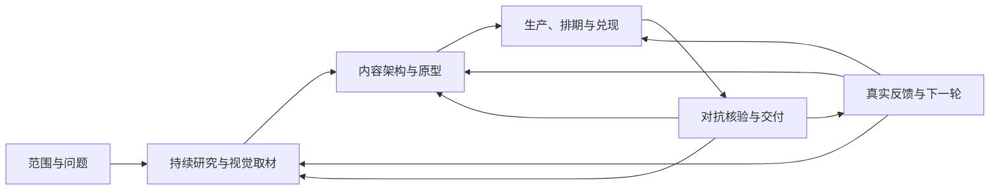

# 策元4 · Ceyuan4

> 面向中国市场的活动策划与系列事件营销 AI Skill。从真实需求出发，持续研究、开发内容、统筹执行与宣传，再根据反馈修订。支持商业地产、街区、多周节庆、轮换体验与持续运营，也保留通用活动、既有方案审查和局部修订能力。

仓库：[DONGaOtang/ceyuan-4](https://github.com/DONGaOtang/ceyuan-4) · 技能名称：`ceyuan4` · 中文名称：策元4 · 专属调用：`/ceyuan4`

它是一套供 AI Agent 按任务读取的工作方法，不是独立运行的软件。联网、图片读取、Office文件生成和发布能力由实际使用的环境提供；交付深度与格式按本次用途和真实工具能力确定。

策元2的旧图保存在 [历史资产索引](assets/HISTORICAL.md)，供版本回溯；它们已退出现行说明，不承载策元4的路由、确认或交付规则。以下文字、表格与可维护流程图说明当前方法。

## 它解决什么问题？

你可以把策元4理解成一个“活动策划总监陪练”：既帮助从零策划，也能按范围审查已有方案或修订局部内容。

- **流程**：按范围/问题、持续研究取材、内容原型、生产排期、对抗交付、反馈更新组织工作；旧Step0—9是可合并/并行/复用的能力索引，实质决定才处理确认。
- **搜索**：先读用户材料，再按项目问题选择公开来源、授权反馈与适用案例；公开来源为主，登录/付费/内部资料是条件扩展。行业入口可动态扩展，先验证访问能力，只引用实际取得的内容。路径见 [搜索模块](references/search-paths.md)。
- **交付**：先明确谁拿到后要审、改、算或执行，再选择最小文件组合与可编辑载体；只要一段或一个文件，就按该范围处理。
- **验收**：检查具体内容、前后串联和真实文件，并用成品完成一个约定动作；未确认资源或未完成检查不算已验证。

普通 AI 经常这样做：

```text
你：帮我做一个发布会方案
AI：好的，以下是发布会流程：签到、领导致辞、产品介绍、互动抽奖、合影……
```

这类答案看起来完整，但经常没用。因为它没弄清楚几个关键问题：

- 这场活动到底是为了卖货、融资、招商、造势、维系关系，还是给内部汇报？
- 谁掏钱？谁拍板？谁到场？谁会反对？
- 活动成功到底看什么？到场人数、线索、订单、媒体曝光、领导满意，还是长期品牌资产？
- 创意只是换个主题包装，还是改变了用户行为？
- 方案被老板、客户、赞助商、政府、执行团队质疑时，能不能扛住？

这些判断服务本次真实目标。观看、学习、理解和关系建立都可以是活动价值；销售、报名、赞助、公开传播等模块只在有对应任务时展开。

## 适合谁用？

适合：

- 市场、品牌、公关、新媒体、运营、销售支持团队
- 需要写活动方案、发布会方案、招商会方案、年会方案、峰会论坛方案的人
- 乙方策划、广告公司、活动公司、咨询顾问
- 想把“有个想法”变成“能上交方案”的人

不太适合：

- 只想拿一份通用模板、不需要项目判断的人
- 完全不愿意回答背景信息的人
- 已经确定只要照搬旧活动流程，不想重新判断目标的人

## 它能做哪些活动？

它不只做热闹的 To C 活动，也覆盖很多容易被模板忽略的场景。

| 类型 | 例子 | 它重点解决什么 |
|---|---|---|
| 品牌与传播 | 新品发布会、快闪、市集、品牌周年庆 | 怎么让活动有记忆点、传播点、可解释的创意机制 |
| 销售与招商 | 招商会、经销商大会、展会、品鉴会 | 怎么把活动接到线索、跟进、成交和 CRM 回填 |
| 内部活动 | 年会、团建、表彰会、内部文化活动 | 怎么避免流程化、尴尬化、只剩领导讲话 |
| 文化与专业交流 | 读剧会、阅读活动、闭门技术研讨 | 怎么写出完整内容、人物关系或问题讨论，不强加销售与公开传播 |
| 政企与仪式 | 开工仪式、揭牌仪式、政企推介会 | 怎么处理身份、秩序、合规、审美风险 |
| 内容型 campaign | 小红书/抖音/视频号活动、UGC 征集、线上线下联动 | 怎么把内容机制和活动机制连起来 |
| 多周系列事件 | 商业地产、街区、多场节庆、轮换体验与持续运营 | 怎么将地址研究、活动组合、邀请、逐日信息、共享资源和每周调整统筹起来 |
| 高端私域 | 私享会、高端客户答谢、金融/医疗/艺术文化活动 | 怎么避免廉价感、冒犯感和身份错位 |

## 多周系列事件怎样工作？

用户要求多周统筹、跨期多个实际场次、轮换内容或持续运营时，加载 [系列事件统筹](references/series-campaign-orchestration.md)。单场活动不会仅因预热时长或同日环节数量自动启用系列统筹；明确要求多周统筹时仍按实际任务判断。“一个半月”须分别明确筹备、预热、运营、收尾日期，不固定换算成45天。

- 商业地产先由地址核实项目身份，研究商圈、租户、竞品、历史活动及公开口碑，再从本地、国内和国外案例提炼可迁移机制；事实、推断与待补经营数据分开。
- 已有方案、记录、复盘和照片视频先识别版本、实际读看范围、计划/实绩及当前适用性，说明本期保留、改写或待核项。长期项目定位与本期活动主张分开，再把营销任务分配给实际单元和场次。
- 建立母题、持续体验、重点场次、轮换内容和复访理由；内容单元与实际场次分开，同作复演如实注明。艺人、嘉宾、KOL、KOC按任务和匹配依据拟邀，费用、档期与确认状态分别标注。
- 有线上任务时，线上分支与对应核心内容同时设计，说明参与价值、实际兑现端及下一轮承接；有线下体验才说明现场连接，纯线上项目核对线上观看、投稿、反馈等真实接收端，纯线下闭门项目不强加公域传播。约定逐日信息时覆盖完整周期，写清对象、信息要点、素材、账号、行动入口和责任人，关键内容交代表稿。每日有安排不等于全平台每日发。
- 线上渠道与项目屏幕、商户、社区等实际可用线下触点共用受众、节点、信息、行动入口与兑现端；分别维护宣传表达、执行资源和实际到访服务，曝光或路过不直接算新增客流。
- 核对共享资源、制作产能、预算去重、人数口径和效果依据。运营中按实际数据补证、调整下一周的具体内容/服务并复核版本；改期、取消追踪邀请、预告、素材、资源、预算和用户通知的连带变化。

实际涉及线下内容、执行与线上传播的整合大案，按 [文件分工与体验深化](references/campaign-deliverables-and-playability.md) 分别交线下创意、线下执行（含全项目唯一总预算）、宣传方案。创意维护故事/体验/人物与潜在传播角度；执行维护实际场次/资源/履约/费用；宣传维护节点、KOL/KOC任务、素材/代表稿与逐日内容。独立研究、招募到访、测量等按接手需要扩展，完整正文和可编辑主值只维护一处，用稳定编号、版本和链接关联。执行Excel只承载相同执行用途的表，宣传日历不再默认混装；轻量、纯线上或局部任务按范围裁剪。

可玩性落实到易理解的入口、实际所得、有意义的选择与反馈、不同能力/观看路径和真实变化；不能用复杂积分、扫码和奖品证明好玩。人物形象和拟传播时刻有真实内容与行为支撑，不预写自然好评或保证爆红；可审阅原型、真实用户测试和真实传播效果分别判断。

持续产出还要检查七件事：连续内容是否增加价值或承担必要提醒；整组内容能否让人记住项目与地点；不同参与阶段是否受到重复负担；创作者的真实Brief与稿件是否各有贡献、任意入口是否有效；运营决定能否说明继续、调整、暂停和恢复的证据；热度突增时接待、预约和宣传是否同步；复盘经验是否保留适用条件。检查结果必须落到实际稿件、排期、服务或投入决定，主定义和接口见下方模块表。

维护时可用合成场景检查只有地址缺数据、同作复演、改期或资源取消、线上无法兑现、传播好但到访弱、单场长预热、纯线上及局部任务等边界。测试周期、日期、人数和费用只是测试输入。实际文件与代表变更检查、模型模拟、真人反馈和真实经营效果分别记录，不由自评分判通过；本地测试记录不随仓库分发。

## 零基础上手

### 第一步：安装

从本仓库获取完整技能：

```bash
git clone https://github.com/DONGaOtang/ceyuan-4.git ceyuan4
```

也可以在GitHub点击 **Code → Download ZIP**。解压后将完整技能目录命名为 `ceyuan4`，复制到所用Agent配置的技能目录。已有同名技能时先保留本地修改，再比较更新；安装后按宿主工具的方式刷新技能。

| 工具 | 目录示例，实际以宿主配置为准 |
|---|---|
| Codex | `~/.codex/skills/ceyuan4/` |
| 通用 Agents | `~/.agents/skills/ceyuan4/` |

关键点只有两个：

- `SKILL.md` 必须在文件夹根目录。
- `references/` 文件夹必须一起保留，不要只复制 `SKILL.md`。

### 第二步：启动

你可以直接说：

```text
用策元4，帮我策划一场新品发布会
```

专属调用名为 `/ceyuan4`；支持命令解析的环境可直接使用，其他环境用“策元4”或 `ceyuan4` 点名调用。

也可以更简单：

```text
帮我做一个公司年会方案
```

支持自动技能匹配的环境，可以根据“活动策划、活动方案、发布会、年会、招商会、快闪、峰会、campaign、直播活动、仪式活动、文旅节庆”等活动组合信号触发；实际命令解析与自动匹配取决于宿主支持。单独出现“方案”不构成触发，必须能判断为活动、营销 campaign、会议会务、仪式、展会、节庆、赞助或线上/线下参与机制相关需求。

### 第三步：回答问题

它先读取已有任务和材料，再判断哪些缺口会影响当前工作。必要问题集中提出；已有信息足够时直接继续研究、条件草案或已选方向深化。答不上可以说“不知道”，未知事实与确定性结论分开。

| 必要时会问 | 对当前判断的作用 | 你可以怎么答 |
|---|---|---|
| 为什么要办这场活动？ | 动机错了，方案全错。卖货和招商不是同一种活动。 | “主要想拿销售线索”“老板想做品牌声量”“其实是客户关系维护” |
| 谁付钱？预算多少？ | 预算决定方案体量，也决定哪些创意不能装。 | “预算还没定，先按 10 万以内想”“甲方出钱，但供应商要赞助” |
| 给谁看？谁拍板？ | 给老板、客户、政府、用户看的方案，写法完全不同。 | “先给老板过会”“要拿去竞标”“给内部执行团队用” |
| 有什么内部资源？ | 私域、会员、销售名单、老客户、场地资源，AI 搜不到。 | “有 3000 个会员”“销售有 200 个重点客户名单”“没有现成资源” |
| 有没有不能碰的东西？ | 合规、品牌禁区、审美风险，晚发现就返工。 | “不能太网红”“不能提价格战”“政府领导会到场” |

## 第一次怎么问？直接复制这些

如果你什么都没准备，用这个：

```text
用策元4帮我策划一场活动。
我现在只有一个模糊想法：{写你的活动想法}。
请先不要直接写完整方案，先问我必须补充的信息。
```

如果你要给老板看，用这个：

```text
用策元4做一份能给老板过会的活动方案。
活动类型：{发布会/年会/招商会/峰会/快闪等}
目标：{你认为的目标，不确定也可以写不确定}
预算：{大概预算}
时间地点：{已知信息}
请先判断这是什么局，再给我方案结构。
```

如果你是乙方，要提案或竞标，用这个：

```text
用策元4帮我做乙方提案。
客户背景：{客户是谁}
项目需求：{客户原话}
竞争情况：{是否比稿/竞标/已有供应商}
预算和交付：{已知信息}
请先拆解甲方真实动机、决策人关注点和提案风险。
```

如果你要做新媒体 campaign，用这个：

```text
用策元4策划一个线上线下联动 campaign。
品牌/产品：{是什么}
目标人群：{谁}
平台：{小红书/抖音/视频号/B站/私域等}
目标：{曝光/报名/线索/成交/UGC/品牌认知}
请先给我活动机制，不要只写内容选题。
```

商业地产系列事件可这样启动：

```text
/ceyuan4
项目地址：{实际地址}
计划周期：{筹备/预热/运营/收尾的已知日期，未知可标未知}
任务：一个半月的系列事件营销，统筹线下活动、艺人及KOL/KOC邀请、线上事件、逐日内容与资源预算。
交付：线下创意、线下执行（含唯一总预算）、宣传方案分别成件；研究、到访运营和测量按独立接手需要扩展，各件用编号和版本关联。
请先研究项目与商圈，说明关键缺口及对策划的影响，按持续研究/生产循环推进；已授权的常规深化继续，实质取舍形成可审阅选项并处理确认。
```

## 它的工作流程

策元4不是“写方案机器”，而是一个从混乱到收口的流程。



图中六项是可合并、并行和返回的工作包，不是六次审批。完整正文按用途分件：创意维护内容与体验；执行维护实际场次、资源及含线上线下费用的唯一预算；宣传维护节点、逐日内容与稿件。研究、到访与测量按独立接手需要扩展，各件通过编号和版本关联，不各自复制主值。

默认按 [持续研究生产循环](references/research-and-content-production-loop.md) 工作：范围与目标→关键词检索/多源核对/视觉取材→内容原型→生产与兑现→对抗核验/交付→真实反馈与下一轮。工作包可合并或并行；已选方向的常规深化继续，需改变目标、主创意、预算或承诺等取舍时处理实质决定，不再每轮一个Step或逐步硬暂停。

关键词、真实查询/原文读取/失败换路、图/页/帧观察与摘图状态实际记录；横纵对照给具体采用判断。研究与视觉资料有独立维护用途时分别成件；单图的来源与观察可以留在该图说明，不强建两份文件。采用结论回接实际稿件、素材Brief、资源和备用；运营中真实反馈触发补研究、实际改稿/改服务及受影响版本复核，结束后复盘归档。必要内容不因节约Token缩减，分批/保存用来防止截断。下表是旧专业能力的检查菜单，不能读成十轮顺序审批。

| 阶段 | 它在做什么 | 你会看到什么 |
|---|---|---|
| Step 0 判局分流 | 先判断这是甲方自用、乙方提案、To C、To B、To G、内部活动还是 campaign | 主路由、辅路由、排除路由、关键缺口 |
| Step 1 信息采集与横纵分析 | 先读已有材料并检查来源访问能力，收集与项目有关的正反信号 | 关键依据、正向机会、反向警告、待验证项及来源限制 |
| Step 2 行为改变 | 把“目标人群”拆成谁要改变什么行为 | 已知动机/待验证假设、当次必要角色、具体阻力 |
| Step 3 经营模型 | 把“办得好”改成可证明、可采集、可取舍的目标 | 业务目标、主判据、关键预算/数据/降级结论 |
| Step 4 中国市场叙事 | 找到本次读者能理解和复述的内容主线 | 实际内容关系与关键表达；冲突、主场面及媒体表达按真实任务采用 |
| Step 5 创意机制 | 未选方向时比较适用候选，已选方向直接深化 | 可比较的候选或实际内容原型，不强凑数量 |
| Step 6 交付系统 | 按本次用途核对内容、资源与接手条件；执行任务落实排产与降级 | 最小交付安排、责任摘要、最大卡点及适用的执行表 |
| Step 7 Red Team 对抗 | 攻击当前阶段内容与策略风险；最终文件按约定到期阶段检查 | 最高风险、修法、失败降级 |
| Step 8 成案 | 按确认用途完成客户文件，另存内部决策与审查记录 | 本次约定的客户文件，不自动附送内部记录 |
| Step 9 终审模拟 | 按实际读者审查，并在真实成品上测试约定的代表动作 | 判词、必改项、实测结果和未检项 |

## 一个极简例子

输入：

```text
帮我策划一个 5 万预算的公司年会，100 人左右，不想太无聊。
```

普通模板可能会给：

```text
签到入场 -> 领导致辞 -> 节目表演 -> 抽奖 -> 晚宴 -> 合影
```

策元4会先拆：

| 问题 | 可能判断 |
|---|---|
| 这是不是“热闹”问题？ | 不一定。可能是员工疲惫、团队断层、优秀员工缺少被看见。 |
| 100 人、5 万预算意味着什么？ | 先核对场地、舞美、餐饮等实际成本和内容任务，再比较资源组合；仅凭人数与总额不能判定制作形式。 |
| 成功怎么看？ | 到场率、参与率、员工内容产出、优秀员工被记住、活动后满意度。 |
| 创意不能只是什么？ | 不能只是换主题色、换口号、换主持词。 |

然后它可能给 3 个方向：

| 方向 | 核心概念 | 为什么不是普通年会 |
|---|---|---|
| 公司小史馆 | 每个团队贡献一个“今年最有代表性物件” | 把成果从 PPT 变成可触摸的共同记忆 |
| 反向颁奖礼 | 员工提名那些平时没人看见但真正救场的人 | 把表彰从领导视角改成同伴视角 |
| 明年预演局 | 每组用 5 分钟演出“明年最想发生的一件事” | 把年会从总结会改成共同想象 |

选定方向后，再深化预算、流程、物料和执行安排，经过对抗审查、成案与终审。

十步与角色作为能力菜单按当前问题合并、并行、复用或返回；确认由实际取舍触发。工作包沿用真实需求记录，逐项核对行业适配、具体内容、关系串联、可用资源和最终文件；摘要短，不代表交付正文只能写几句。行业表是校准起点，未知行业须补专业资料与适用标准，不能只换行业名称。

每轮先核对已有续接记录，再按需读回实际正文；有实质产出就保存并更新阶段、确认状态、文件位置和下一步。上下文压力有可信数据才报告，没有则记未知；续接不能改变模型窗口大小、强制压缩或代替用户确认。

## 最终会产出什么？

交付深度由本次用途、内容成熟度和实际接手动作决定，活动复杂度帮助确定颗粒度。下表是候选，不是每次必交清单。

| 交付深度 | 适合场景 | 通常包含 |
|---|---|---|
| 一页创意 | 你只想先拿方向 | Big Idea、目标、核心机制、传播钩子 |
| 标准方案 | 常规活动、内部提案 | 背景、核心问题、目标、创意机制、流程、传播、执行、预算、风险、验收 |
| 全案执行版 | 大型活动、跨团队协作 | 分工表、物料表、倒排期、现场流程、供应商边界、应急预案 |
| 系列事件全案 | 多周、多场次、轮换或持续运营的整合大案 | 创意、执行与宣传按用途分别成件，扩展内容按独立接手需要；研究、场次、邀请、逐日信息、资源预算与周调跨文件关联 |
| 竞标/招商版 | 乙方提案、赞助提案 | 客户视角、商业价值、权益设计、报价边界、验收口径 |

Step8保留活动方案与内部过程记录的内容分层，客户实际接收的文件按用途和已确认范围确定；强叙事文化节庆、艺术展演或明确要求独立概念案时提供相应概念内容。用户只要概念案或单文件时按指定范围交付，内部记录不自动追加为客户附件。

| 文件 | 给谁看 | 内容 |
|---|---|---|
| 概念案（条件触发） | 客户、主创、设计与内容评审 | 完整活动介绍、故事与单元内容、观众旅程、系列关系、视觉及参考 |
| 活动方案 | 老板、客户、市场部、执行负责人 | 干净正文：业务问题、目标、创意、执行、预算、风险、验收 |
| 思考过程 | 策划者、复盘者、二次修改者 | 决策摘要、关键决策记录、风险与验证地图、可下钻附录；摘要长度依接手需要 |

概念案必须让人读懂整场体验：每个主要单元写清发生什么、观众看见或做什么、如何完成、为什么接下一段。配图和参考案例服务理解；没有图片时可用文字分镜辅助说明，但不能抵交已约定的实际图片或视觉成稿，也不能用漂亮图或时长表掩盖内容空缺。详见 [叙事与概念案交付](references/narrative-and-concept-delivery.md)。

用户点名的文件、格式与用途优先于默认清单。概念案、执行案、传播稿、脚本、预算表等分别按实际成熟度验收；有目录、标题或文件名不等于已交付。只在本项目需要时生成相应文件，并检查内容、可编辑性/可打开性、链接及跨文件口径；不能承诺一份模板天然覆盖所有行业和所有标准。

维护本技能时，每条修改都要追踪到入口、角色、引用模块、模板、输出和验收中的受影响位置，并记录实际改动或无需改动的理由；用跨步骤场景和反例验证联动。更新一处说明、保留冲突的旧例子，或仅证明文件副本相同，都不能算修改已全局生效。

全层审核按当轮实际清单审读现行文件，并区分必要约束、本项目生产参数、历史案例/测试常量与无依据的通用配额。现行调用、历史自编脚本和第三方依赖分开；检查脚本的路径、写入、副作用、依赖及失败处理后才判断是否适合运行。旧脚本不直接覆盖新报告；静态检查、实际产物试跑和真实效果分别报告。文件数量、搜索命中、模型评分和退出码不能代替语义审查。

执行类正式方案通常会包含以下适用内容；概念案不强塞执行大表，传播等模块按实际任务选取：

- 一句话 Big Idea
- 活动目标和成功标准
- 受众与参与路径
- 创意机制和现场体验
- 传播设计
- 执行时间线
- 人员分工
- 物料清单
- 预算表
- 风险预案
- 验收指标
- 待确认事项

详细事实假设、证据索引、完整推导、Red Team、实验计划和复盘回填模板默认进入内部“思考过程”。影响拍板的关键依据、条件、风险和待确认事项在正式正文保留足够的摘要，不能因分层而删掉。

## 它和普通提示词有什么区别？

| 普通提示词 | 策元4 |
|---|---|
| 直接生成方案 | 先判局，再生成 |
| 容易套模板 | 有反陈旧审查 |
| 只问活动类型 | 会问钱流、资源、决策人、合规边界、数据采集和交付边界 |
| 创意靠灵感 | 按真实资料、人群所得、项目条件和已选方向开发实际原型；必要时比较适用候选，创意公式只是可选方法 |
| 方案看起来完整 | 会同时攻击策略风险和交付矛盾 |
| 活动结束就结束 | 运营中依据真实反馈补研究、实际修稿/改服务并复核版本；结束后复盘与案例归档 |

## 模块地图

策元4现在有多个 `references/` 模块。你不需要全读，它按当前任务、依赖与真实场景加载：判局用判局模块，预算用经营模块，文旅强叙事先过边界模块，赞助招商用赞助履约模块，信息采集先走来源访问与登录工作流。Step编号帮助定位能力，不规定十轮顺序。

## 文件结构

你不需要一开始读懂所有文件。零基础只要记住：

- `SKILL.md` 是入口，相当于总导演。
- `references/` 是工具箱，相当于不同专家的工作手册。
- `output/` 是沉淀区，案例、跑测、用户项目稿和改进建议先写这里。
- README 是给人看的说明书，不参与实际运行。

```text
ceyuan4/
├── README.md
├── SKILL.md
├── LICENSE
├── assets/
│   └── HISTORICAL.md              # 历史图索引，不作为现行规则
├── output/                       # 本地运行时创建，仓库忽略此目录
│   ├── case-library/
│   ├── run-reviews/
│   ├── user-projects/
│   └── improvement-log/
└── references/
    ├── research-and-content-production-loop.md
    ├── series-campaign-orchestration.md
    ├── campaign-deliverables-and-playability.md
    ├── triage-router.md
    ├── anti-hallucination-and-evidence.md
    ├── stakeholder-behavior-change.md
    ├── business-model-and-budget.md
    ├── china-market-narrative.md
    ├── critical-path-delivery.md
    ├── ai-role-prompts.md
    ├── role-overlays-by-scenario.md
    ├── source-access-and-login-workflow.md
    ├── culture-tourism-boundary.md
    ├── creative-inputs.md
    ├── anti-stale-creative.md
    ├── experiment-validation.md
    ├── proposal-schema.md
    └── ...
```

常用参考模块：

| 文件 | 作用 |
|---|---|
| `triage-router.md` | 判断这是什么活动局 |
| `research-and-content-production-loop.md` | 优化工作循环、实际关键词与检索、多源及横纵分析、视觉取材、内容生产与备用、反馈回接与实质验收 |
| `series-campaign-orchestration.md` | 贯通系列研究、内容与场次、邀请、线上逐日信息、共享资源预算、测量调整及关联工作簿验收 |
| `campaign-deliverables-and-playability.md` | 创意/执行/宣传文件边界、用户到访与可玩性、真实人物和自然传播条件、跨文件主维护与体验验收 |
| `anti-hallucination-and-evidence.md` | 管事实分级、来源绑定和防编造 |
| `ai-role-prompts.md` | 让 AI 在不同阶段切换角色 |
| `role-overlays-by-scenario.md` | 按乙方竞标、政企、To B、文旅、年会、发布会等场景叠加角色判断 |
| `search-paths.md` | 维护开放的商业地产/营销来源职责与入口，按项目疑问动态扩展，记录实际访问和证据边界 |
| `source-access-and-login-workflow.md` | 管联网、浏览器、登录、权限、验证码、降级和采集状态 |
| `culture-tourism-boundary.md` | 管文旅强叙事示例的加载边界，防止污染普通活动 |
| `stakeholder-behavior-change.md` | 把目标人群拆成具体行为改变 |
| `business-model-and-budget.md` | 处理预算、成本、回报和降级模型 |
| `china-market-narrative.md` | 建中国市场可复述的主叙事 |
| `narrative-and-concept-delivery.md` | 写完整概念、内容单元与前后串联，并按用途验收 |
| `creative-inputs.md` | 开发内容原型，比较适用候选或深化已选方向 |
| `anti-stale-creative.md` | 检查创意是不是陈旧模板 |
| `critical-path-delivery.md` | 维护关键路径、职责、资源和真实接待状态；热度突增时联动预约、宣传及现场服务 |
| `registration-and-attendance.md` | 处理报名、邀约、到场和 no-show |
| `sponsorship-fulfillment.md` | 处理赞助权益、履约和 ROI 回报 |
| `data-capture-and-review.md` | 处理数据采集和复盘，保留经验的适用条件、证据强度、其他解释和重新核验条件 |
| `experiment-validation.md` | 设计 AB 测试或低成本预检 |
| `boardroom-proposal-schema.md` | 写能上交的正式方案 |
| `activity-word-template-and-adaptation.md` | 处理 Word 输出模板、4A 产出逻辑、思考范围和不同活动适配 |
| `pitch-winning-proposal.md` | 强化老板过会、竞标、中标力和年度事件叙事 |
| `pitch-battle.md` | 乙方竞标、比稿、招商提案 |
| `metrics-flow.md` | 按实际数据连接判断、补证与修订，说明继续/调整/暂停/恢复及合同和投入条件 |
| `new-media-campaign.md` | 逐日内容、平台角色和创作者真实Brief/稿件接力；检查任意入口能独立理解和参与 |
| `creative-director-quality-bar.md` | 检查实际内容组合的项目/地点记忆，区分模型模拟与真实受众预检 |

## 常见问题

### 我不会策划，可以用吗？

可以。它本来就是给“脑子里有一点想法，但不知道怎么拆、怎么写、怎么上交”的人用的。你只要能回答基本事实：活动给谁看、为什么办、大概多少钱、有什么限制。

### 我什么信息都没有怎么办？

直接说“不知道”。策元4按缺口对当前判断的影响处理，关键问题集中提出，不按数量机械暂停。独立研究、创作拟案和条件草案可以继续，需你决定的实质取舍先形成可审阅选项，仅暂停依赖决定的定稿。未知客流、容量、费用和档期不能写成已确认事实。

### 它会不会问太多？

只提出已有材料未回答、且会影响当前判断或承诺的问题，不重复索要已经提供的信息。独立研究和条件拟案继续；需要你决定的取舍先形成具体可审阅选项。

### 能不能让它一次性写完？

可以。你可以说：

```text
用策元4完成本次范围的一版方案，信息不足处明确事实、拟案和待核条件；需要我决定的实质取舍给具体选项。
```

方向未定时，先比较适用候选并选定重点；已有方向直接深化，不为完成流程重新选题。需要改变已确认目标、主创意、预算或承诺时再处理具体取舍。

### 它能导出 docx 吗？

取决于 Agent 环境的生成与检查能力。需要 Word 时，它会先检查可用工具，再生成和检查真实 DOCX；若做不到，会明确说明“未生成 docx”，保留可编辑内容源稿，不能把 Markdown 当作已完成的 Word 交付。PPTX、工作簿和其他载体同样按本次用途、工具能力和实际检查结果处理。

### 需要联网吗？

不一定。普通内部活动可以不联网。涉及行业法规、城市报批、消防、广告法、竞品案例、近期热点时，应该联网核实，不能凭印象写。

对于小红书、抖音、微博、B站、知乎评论区或付费数据平台，策元4不应默认都能自动采集。它会先检测访问状态；如果需要登录、验证码或账号权限，只列本次最小必要清单让你选择。你不登录时，它会降级到公开网页、搜索引擎 `site:`、官方/媒体/报告源，并标注证据限制。

对标资料分别记录正文已读范围、视觉已看页/帧和原生编辑性是否核验。看到封面不等于读完方案，读取文字不等于看过版式，看到 PDF 不等于取得可编辑源文件。

## 关键词

活动策划、活动方案、发布会、年会、招商会、峰会论坛、快闪、市集、路演、品牌活动、新媒体 campaign、AI Skill、AI Agent、提示词工程、第一性原理、Red Team、对抗式审查、营销策划、创意陪练、指标闭环。

推荐 GitHub Topics：

```text
event-planning event-marketing marketing-campaign ai-agent ai-skill prompt-engineering red-team first-principles chinese
```

## 研究与审核依据

研究按“问题 → 关键词 → 实际查询 → 打开的原文 → 实际读看范围 → 证据 → 判断变化”留下记录。横向比较同类项目、机制、人群与条件，纵向核对本项目历史、周期及内容演变。来源主目录见[搜索路径](references/search-paths.md)：覆盖项目与商户官方信息、商业地产与零售研究、地图与交通、公开口碑、同档期活动、国内外案例、艺人创作者、视觉制作、平台规则和当地运营条件；非网站证据包括授权经营数据、现场观察、反馈及供应商正式资料。按问题动态扩展，不要求遍查全部网站，也允许目录外的关键证据。

多站转载同一通稿不算独立印证；图片链接存在、画面已看与摘图已取得分别记录。案例机制存在不等于效果已证明，平台公开互动不直接证明新增客流或销售贡献。

审核从目标、参与者所得、实际内容、资源、成本和测量条件推导，再提出最强反驳、薄弱证据、替代解释与失败条件，修复实际稿件、排期或服务。场次、邀请、入口、容量、费用和指标须引用同一版本；文件名、目录、生成成功或模型评分不等于内容可用。在真实成品上核验适用的代表动作，区分事实、拟案、资源待核、模拟与实绩。详见[对抗审查](references/adversarial.md)、[质量标准](references/creative-director-quality-bar.md)和[方案验收](references/proposal-schema.md)。

发布前、场次后、异常时、每周和全期结束的复核嵌入实际工作流，不另设固定审批层。

## 仓库发布范围与维护

仓库发布技能入口、中文说明、许可证、全部现行参考模块，以及明确标记的历史展示资产。本地 `output/` 中的项目、案例、试跑、审查与维护记录，历史脚本和第三方依赖不随技能包发布。当前正式技能不依赖这些历史工具。

部分参考保留维护时本地历史记录的路径，供本机溯源；这些路径不是公开包内附件，也不作为运行依赖。正式方法的适用性仍须根据实际任务核对，不能由历史审计结论替代。

方法维护时，继续追查入口、角色、专业规则、模板与终审的关联；无依据的通用配额应处理为按需方法或项目参数。预算公式、容量限制、合同参数，以及明确标记的历史或测试数据保留各自用途，不把“存在固定值”直接等同于错误硬编码。

## 许可证

本项目采用 [MIT License](LICENSE)。
